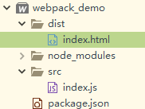
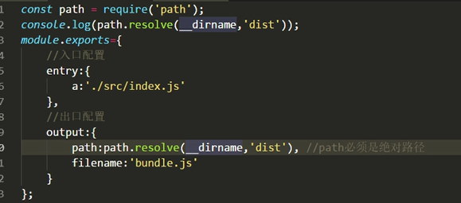

# 初探webpack

目录结构如下:

dist/index.html主要代码如下:

~~~html

			

~~~

src/index.js主要代码如下:

~~~js
var oRoot = document.querySelector("#root")
oRoot.innerHTML = '你说管哥帅不帅'
~~~

此时如果执行index.html,我们可以看到由于不存在boundle.js文件,因此会报错.

首先我们进入到webpack_demo目录,在cmd中执行

~~~
webpack src/index.js --o dist/boundle.js
~~~

执行完毕之后,将会在dist目录中产生一个boundle.js文件,再次执行index.html将会成功.

# 基本配置

#### webpack.config.js配置文件

webpack在执行时，**`除在命令行传入参数，还可以通过指定的配置文件来执行`**。默认会搜索当前目录下webpack.config.js.这个文件是一个node.js模块，返回一个json格式的配置对象，或者通过--config选项来指定配置文件。

参考如下:

~~~js
module.exports={
	//入口配置 - 最小配置
	entry:{},
	
	//出口配置 - 最小配置
	output:{},
	
	//moudle.rules规则
	//loaders
	moudle:{},
	
	//插件 - 生成环境
	plugins:[],
	
	//开发服务器
	devServer:{}
}
~~~

### 最小配置-出口和入口

~~~js
console.log(__dirname)
module.exports={
	//入口配置
	entry:{
		//key是随便取的
		entry_src:'./src/index.js'
	},
	
	//出口配置
	output:{
		//需要是一个绝对地址,nodejs里面提供的全局变量__dirname
		path:__dirname+'/dist',
		filename:'boundle.js'
	}
}

~~~

配置完成之后,在cmd中直接执行

~~~
webpack
~~~

执行完毕之后看是否存在bounlde.js文件.

获取采取如下方式:

##### 注意点

如果我们将webpack.config.js文件名改成success.config.js的话,那么如果直接执行webpack的话,将会生成一个main.js文件.我们应该执行如下命令来指定success.config.js:

~~~
webpack --config success.config
~~~

# mode模式

1. webpack --mode development
2. webpack --mode production - 明显文件会被压缩