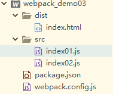

# JS多入口(打包到一起,也就是多对一打包)

[参考详解](https://blog.csdn.net/xyphf/article/details/79824777)

首先,还是来看一下目录结构;

**pakage.json文件内容如下:**

~~~json
{
  "name": "webpack_demo03",
  "version": "1.0.0",
  "main": "webpack.config.js",
  "scripts": {
    "build": "webpack --mode development"
  },
  "keywords": [],
  "author": "",
  "license": "ISC",
  "description": ""
}
~~~

**webpack.config.js配置文件内容如下**:

~~~js
const path = require('path')

module.exports={
	//入口配置 - 按照顺序
	entry:['./src/index01.js','./src/index02.js'],
	//出口配置
	output:{
		//path必须是绝对路径
		path:path.resolve(__dirname,'dist'),
        //表示输出的js文件名
		filename:'index.js'
	}
}
~~~

在控制台上执行:

~~~
npm run build
~~~

一旦执行成功之后,将会在dist目录下面出现一个index.js文件.

执行``npm run build``本质上就是将index01.js文件和index02.js文件打包到一个文件index.js中

# **JS多入口多出口?也就是多对多的实现**

目录结构保持不变,修改webpack.config.js文件

~~~js
const path = require('path')

module.exports={
	//入口配置
	entry:{
		test01:'./src/index01.js',
		test02:'./src/index02.js'},
	//出口配置
	output:{
		//path必须是绝对路径
		path:path.resolve(__dirname,'dist'),
		//filename前面我们可以使用一个变量[name],
		//这个就表示获取entry里面的key作为文件名加在前面
		//生成出来的是test01.js和test02.js
		filename:'[name].js'
	}
}
~~~

这时运行 npm run build ,这时dist里面打包出来的就是test01.js和test02.js了.

麻烦的是,我们还是需要手动在index.html文件中引入test01.js和test02.js文件.如何进行处理呢?

我们继续学习html-webpack-plugin插件的使用

# **html-webpack-plugin**插件

**如何使html自动引入js文件?**

**html-webpack-plugin**插件,这个插件的注意功能就是生成页面.

[官方网址关于该插件使用手册](https://www.npmjs.com/package/html-webpack-plugin)

**注意:由于插件是依赖webpack和webpack-cli的,所以我们先将webpack和webpack-cli下载到本地**

进入到该web项目的工程,执行安装操作

***第一步:安装操作***

~~~
npm i webpack -D
npm i webpack-cli -D
npm i html-webpack-plugin -D
~~~

***第二步:安装成功以后,在webpack.config.js里面引入***

~~~js
const path = require('path')
const HtmlWebpackPlugin = require('html-webpack-plugin');   
module.exports={
	//入口配置
	entry:{
		test01:'./src/index01.js',
		test02:'./src/index02.js'},
	//出口配置
	output:{
		//path必须是绝对路径
		path:path.resolve(__dirname,'dist'),
		//filename前面我们可以使用一个变量[name],
		//这个就表示获取entry里面的key作为文件名加在前面
		//生成出来的是test01.js和test02.js
		filename:'[name].js'
	},
	plugins:[
		new HtmlWebpackPlugin()
	]
}
~~~

这时我们就可以执行 npm run build 了.我们发现自动创建了dist目录,里面有index.html,index01.js,index02.js文件,并且index.html自动引入了index01.js,index02.js文件.

### 关于HtmlWebpackPlugin的一些配置

1. **配置模板HTML文件**

~~~javascript
   const path = require('path')
   const HtmlWebpackPlugin = require('html-webpack-plugin');   
   module.exports={
   //入口配置
   entry:{
   		test01:'./src/index01.js',
   		test02:'./src/index02.js'},
   //出口配置
   output:{
   		//path必须是绝对路径
   		path:path.resolve(__dirname,'dist'),
   		//filename前面我们可以使用一个变量[name],
   		//这个就表示获取entry里面的key作为文件名加在前面
   		//生成出来的是test01.js和test02.js
   		filename:'[name].js'
   },
   plugins:[
   	new HtmlWebpackPlugin({
   		template:'./templates/index.html'
   		})
   	]
   }
~~~

这个时候我们再运行`npm run build`,我发现自动生成了dist目录,里面的index是我们先前在src里面写的模板文件,并且自动引入了js文件.

2. **自动配置页面title**

   **如果配置了title,一定要在模板html中使用**

   ~~~html
   <title><%= htmlWebpackPlugin.options.title%></title>
   ~~~

   **webconfig.config.js文件中加入:**

   ~~~js
   plugins:[
   		new HtmlWebpackPlugin({
   			title:'I love Success',
   			template:'./templates/index.html'
   		})
   	]
   ~~~

3. **如何自动消除src引入的缓存问题?**

自动引入的src链接，如何消除消除缓存呢?我们只要在html-webpack-plugin配置中增加一个hash为true的配置,它就会自动在引入的src地址后面增加一段hash值

~~~javascript
plugins:[
		new HtmlWebpackPlugin({
            //向html引入的src链接后面增加一段hash值,消除缓存
			hash:'true',
			title:'I love Success',
			template:'./templates/index.html'
		})
	]
~~~

4. **压缩输出**

   ~~~javascript
   plugins:[
   		new HtmlWebpackPlugin({
   			hash:'true',//向html引入的src链接后面增加一段hash值,消除缓存
   			title:'I love Success',
   			template:'./templates/index.html',
   			//压缩输出
   			minify:{
   				collapseWhitespace:true //折叠空白区域 也就是压缩代码
   			}
   		})
   	]
   ~~~

5. **多个HTML模板区分输出配置**

那么要是我们多个html模板文件,如何区分开生成多个页面呢？

只要以链式的方法,再调用一次html-webpack-plugin插件,每次调用都要指定filename也就是生成页面的名字.调用

一次生成一个页面,调用两次生成两个页面,以此类推.

~~~javascript
plugins:[
		new HtmlWebpackPlugin({
			filename:'test01.html', //每次调用指定生成的html名称
			hash:'true',//向html引入的src链接后面增加一段hash值,消除缓存
			title:'I love Success',
			template:'./templates/index.html',
			//压缩输出
			minify:{
				collapseWhitespace:true //折叠空白区域 也就是压缩代码
			}
		}),
		new HtmlWebpackPlugin({
			filename:'test02.html',
			hash:'true',//向html引入的src链接后面增加一段hash值,消除缓存
			title:'I love Success2',
			template:'./templates/index2.html',
			//压缩输出
			minify:{
				collapseWhitespace:true //折叠空白区域 也就是压缩代码
			}
		})
	]
~~~

6. **生成的HTML文件引入各自的JS文件配置**

   那么我们生成多个html文件的时候,我们希望各自引入各自的js文件,那么如何操作呢?比如说我们希望

   test01.html引入的是test01.js， test02.html引入的是test02.js如何操作呢?我们需要在html-

   webpack-plugin中再配置一个参数,chunks,支持数组,数组里面填写的是引入的js,也就是entry里面配置的key,

   要引入哪个js就配置entry中的哪个key.

   ~~~javascript
   const path = require('path')
   const HtmlWebpackPlugin = require('html-webpack-plugin');   
   module.exports={
   	//入口配置
   	entry:{
   		test01:'./src/index01.js',
   		test02:'./src/index02.js'},
   	//出口配置
   	output:{
   		//path必须是绝对路径
   		path:path.resolve(__dirname,'dist'),
   		//filename前面我们可以使用一个变量[name],
   		//这个就表示获取entry里面的key作为文件名加在前面
   		//生成出来的是test01.js和test02.js
   		filename:'[name].js'
   	},
   	plugins:[
   		new HtmlWebpackPlugin({
   			chunks:['test01'],
   			filename:'test01.html', //每次调用指定生成的html名称
   			hash:'true',//向html引入的src链接后面增加一段hash值,消除缓存
   			title:'I love Success',
   			template:'./templates/index.html',
   			//压缩输出
   			minify:{
   				collapseWhitespace:true //折叠空白区域 也就是压缩代码
   			}
   		}),
   		new HtmlWebpackPlugin({
   			chunks:['test02'],
   			filename:'test02.html',
   			hash:'true',//向html引入的src链接后面增加一段hash值,消除缓存
   			title:'I love Success2',
   			template:'./templates/index2.html',
   			//压缩输出
   			minify:{
   				collapseWhitespace:true //折叠空白区域 也就是压缩代码
   			}
   		})
   	]
   }
   ~~~
