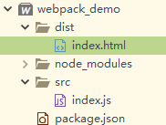
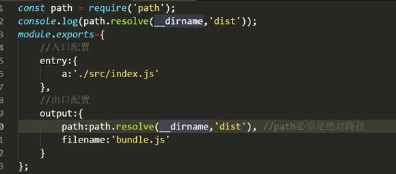

# WebPack


## 课程大纲

1. webpack介绍
2. webpack初探
3. 多入口、多出、html插件使用
4. html插件优化、服务器、热更新
5. loaders作用,处理css文件,及压缩方式
6. 处理图片、分离css
7. less、sass处理、前缀、消除冗余css
8. SourceMap、babel、vue环境配置
9. json配置、模块化配置、静态资源、插件
10. 优雅使用第三方库、提取js文件、优化


# 介绍

[webpack官网](https://webpack.js.org/)

**webpack是什么?**

webpack是一个**模块打包工具**，在开发中，各种各样的资源都可以认为是一种独特的模块资源，比如css，js，ppng，json等。而我们通过webpack，可以将这些资源打包压缩在指定的文件中，需要注意的是，webpack本身是支持js资源的，但我们可以通过loader加载器，来打包除了js之外的资源。Talk is cheap，Let's do it.

**webpack作用?**

1. 打包(解决依赖,把多个文件打包成一个js文件,减少服务器的请求和带宽)
2. 转化(比如less、sass、ts)需要loader
3. 优化(SPA越来越流行,前端项目复杂度高,可以对项目进行优化)

**webpack构成:**

1. 入口 entry
2. 出口 output
3. loaders 转化器
4. plugins 插件
5. devServer 开发所需要的服务器
6. mode 开发模式和生产模式


## 安装webpack

### 前提操作安装nodejs

前提安装[nodejs](https://nodejs.org/en/download/)

[安装nodejs参考](http://www.runoob.com/nodejs/nodejs-install-setup.html)

安装并且配置好环境变量之后,我们就可以使用npm命令来安装我们的webpack.

**修改npm源**,**即使关闭终端也会有效,目的是为了下载速度更快**

```
npm config set registry https://registry.npm.taobao.org 
```

执行该命令之后,将会在用户目录下面,产生一个.npmrc的配置文件.

### 利用npm来安装webpack

暂时,我们采取全局安装,实际过程中,不是每个项目都需要webpack,我们需要在针对不同的项目来安装.

```
npm install webpack -g
npm install webpack-cli -g
```

验证webpack环境是否成功?

```
webpack -v
```

**开发环境:**

平时编写代码的环境

```
npm i jquery --save-dev
或者可以简写成:
npm i jquery -D
```

**生产环境:**

项目开发完毕,部署上线

```
npm i jquery --save
或者可以简写成:
npm i jquery -S
```

**package.json**

项目的依赖配置文件,确保后面参与进来的开发者知道你引用了哪些依赖.

```
npm init -y
```

后期,只需要将该文件交给别人,比如将package.json单独放入一个目录中,然后在cmd中执行

```
npm install
```

就会自动下载这个项目中所需要的依赖.

# 初探webpack

目录结构如下:



dist/index.html主要代码如下:

```html
<div id="root">
			
</div>
<script src="boundle.js"></script>
```

src/index.js主要代码如下:

```js
var oRoot = document.querySelector("#root")
oRoot.innerHTML = '你说管哥帅不帅'
```

此时如果执行index.html,我们可以看到由于不存在boundle.js文件,因此会报错.

首先我们进入到webpack_demo目录,在cmd中执行

```
webpack src/index.js --o dist/boundle.js
```

执行完毕之后,将会在dist目录中产生一个boundle.js文件,再次执行index.html将会成功.


# 基本配置

#### webpack.config.js配置文件

webpack在执行时，**`除在命令行传入参数，还可以通过指定的配置文件来执行`**。默认会搜索当前目录下webpack.config.js.这个文件是一个node.js模块，返回一个json格式的配置对象，或者通过--config选项来指定配置文件。

参考如下:

```js
module.exports={
	//入口配置 - 最小配置
	entry:{},
	
	//出口配置 - 最小配置
	output:{},
	
	//moudle.rules规则
	//loaders
	moudle:{},
	
	//插件 - 生成环境
	plugins:[],
	
	//开发服务器
	devServer:{}
}
```


### 最小配置-出口和入口

```js
console.log(__dirname)
module.exports={
	//入口配置
	entry:{
		//key是随便取的
		entry_src:'./src/index.js'
	},
	
	//出口配置
	output:{
		//需要是一个绝对地址,nodejs里面提供的全局变量__dirname
		path:__dirname+'/dist',
		filename:'boundle.js'
	}
}

```

配置完成之后,在cmd中直接执行

```
webpack
```

执行完毕之后看是否存在bounlde.js文件.

获取采取如下方式:



##### 注意点

如果我们将webpack.config.js文件名改成success.config.js的话,那么如果直接执行webpack的话,将会生成一个main.js文件.我们应该执行如下命令来指定success.config.js:

```
webpack --config success.config
```


# mode模式

1. webpack --mode development
2. webpack --mode production - 明显文件会被压缩
