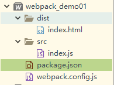
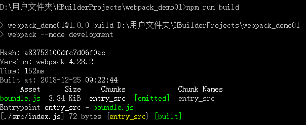

# npm run build

这是属于npm的打包部署命令,我们通过实际操作来感受一下该命令的作用.

首先工程目录还是如下:

webpack.confing.js中只需要配置入口和出口,和上一个章节中的内容一致即可.

打开package.json文件,修改如下配置:

~~~json
{
  "name": "webpack_demo01",
  "version": "1.0.0",
  "description": "",
   //对应的配置文件的名称
  "main": "webpack.config.js",
  "scripts": {
    //修改的地方
    "build": "webpack --mode development"
  },
  "keywords": [],
  "author": "",
  "license": "ISC"
}
~~~

然后进入到webpack_demo01目录中,在cmd中执行:

~~~
npm run build
~~~

出现如图显示结果则表示成功:

