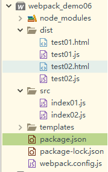

# 服务器和热更新

#### webpack-dev-server

1. **安装webpack-dev-server**

~~~
npm i webpack-dev-server -D
~~~

2. **webpack.config.js配置如下:**

   ~~~js
   const path = require('path')
   const HtmlWebpackPlugin = require('html-webpack-plugin') 
   //const cleanWebpackPlugin = require('clean-webpack-plugin')
   module.exports={
   	//入口配置
   	entry:{
   		test01:'./src/index01.js',
   		test02:'./src/index02.js'},
   	//出口配置
   	output:{
   		//path必须是绝对路径
   		path:path.resolve(__dirname,'dist'),
   		//filename前面我们可以使用一个变量[name],
   		//这个就表示获取entry里面的key作为文件名加在前面
   		//生成出来的是test01.js和test02.js
   		filename:'[name].js'
   	},
   	devServer:{
   		//设置服务器的访问的根目录
   		contentBase:path.resolve(__dirname,'dist'),
   		//服务器ip地址
   		host:'localhost',
   		//设置端口
   		port:8088
   	}
   	,plugins:[
   		// new cleanWebpackPlugin(['dist']),
   		new HtmlWebpackPlugin({
   			chunks:['test01'],
   			filename:'test01.html', //每次调用指定生成的html名称
   			hash:'true',//向html引入的src链接后面增加一段hash值,消除缓存
   			title:'I love Success',
   			template:'./templates/index.html',
   			//压缩输出
   			minify:{
   				collapseWhitespace:true //折叠空白区域 也就是压缩代码
   			}
   		}),
   		new HtmlWebpackPlugin({
   			chunks:['test02'],
   			filename:'test02.html',
   			hash:'true',//向html引入的src链接后面增加一段hash值,消除缓存
   			title:'I love Success2',
   			template:'./templates/index2.html',
   			//压缩输出
   			minify:{
   				collapseWhitespace:true //折叠空白区域 也就是压缩代码
   			}
   		})
   	]
   }
   ~~~

3. package.json文件中配置如下:

   ~~~json
   {
     "name": "webpack_demo06",
     "version": "1.0.0",
     "main": "webpack.config.js",
     "scripts": {
       "build": "webpack --mode development",
       "dev":"webpack-dev-server --mode development"
     },
     "keywords": [],
     "author": "",
     "license": "ISC",
     "description": "",
     "devDependencies": {
       "clean-webpack-plugin": "^1.0.0",
       "webpack": "^4.28.2",
       "webpack-cli": "^3.1.2",
       "webpack-dev-server": "^3.1.14"
     },
     "dependencies": {
       "html-webpack-plugin": "^3.2.0"
     }
   }
   ~~~

4. **确保最终目录结构如下:**

 

5. **启动虚拟服务器**

   ~~~
   npm run dev
   ~~~

6. **打开浏览器**

​       输入http://localhost:8088/dist/test01.html

1. 如果希望执行npm run dev能自动打开浏览器

   ~~~javascript
   devServer:{
   		//设置服务器的访问的根目录
   		contentBase:path.resolve(__dirname,'dist'),
   		//服务器ip地址
   		host:'localhost',
   		//设置端口
   		port:8088,
   		//自动打开浏览器
   		open:true
   	}
   ~~~

到此为止,我们尝试修改test01.js中的内容.发现test01.html自动刷新了,展示出来了最新的内容.

## 模块热替换(Hot Module Replacement)

模块热替换功能会在应用程序运行过程中替换、添加或删除模块，无需重新加载整个页面。主要是通过以下几种方式，来显著加快开发速度：

- 保留在完全重新加载页面时丢失的应用程序状态。

- 只更新变更内容，以节省宝贵的开发时间。

- 调整样式更加快速 - 几乎相当于在浏览器调试器中更改样式。

### 配置webpack.config.js文件

但是通过日志发现页面先热更新然后又自动刷新，这和自动刷新是一样的。 

如果只需要触发HMR，可以再加个参数hotOnly:true,这时候只有热更新，禁用了自动刷新功能。 

如果需要自动刷新就不需要设置热更新。

热跟新必须有以下5点： 

1. 引入webpack 

2. output里加publicPath 

3. devServer中增加hot:true 

4. devServer中增加hotOnly:true 

5. 在plugins中配置  new webpack.HotModuleReplacementPlugin()

