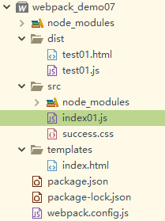
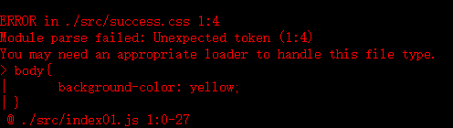

# loaders

[loaders参考](https://blog.csdn.net/xyphf/article/details/79829446)

#### loaders是什么?

loaders在webpack里面是一个很重要的功能 表示加载器、转换器.

#### 为什么要使用loaders?

通常情况下,webpack只对js文件提供支持,但是比如说less/sass/css/ES7等就不认识了,这时候就需要使用loaders来帮助它转化了.

## style-loader和css-loader

传统上我们会在html文件中引入CSS代码，借助webpack style-loader和css-loader我们可以在.js文件中引入css文件并让样式生效.

* css-loader:加载css文件
* style-loader:使用<style>标签将css-loader内部样式注入到我们的html页面中.

**安装**

~~~
npm i style-loader -D
npm i css-loader -D
~~~

## 操作

目录结构如下:

 

主要是在src目录中新建success.css,然后在index01.js文件中引入:

~~~js
import '../src/success.css'
document.write("loaders...")
~~~

此时,执行`npm run build`将会报错:

 

### 解决方案

1. 前提成功安装好style-loader和css-loader

2. 配置:首先我们写一个**module**,在里面**rules**(规则),**rules**是一个**数组**,里面可以写一条一条的规则

   ~~~js
   const path = require('path')
   const webpack = require('webpack')
   const HtmlWebpackPlugin = require('html-webpack-plugin') 
   //const cleanWebpackPlugin = require('clean-webpack-plugin')
   module.exports={
   	//入口配置
   	entry:{
   		test01:'./src/index01.js'
   	},
   	//出口配置
   	output:{
   		//path必须是绝对路径
   		path:path.resolve(__dirname,'dist'),
   		//filename前面我们可以使用一个变量[name],
   		//这个就表示获取entry里面的key作为文件名加在前面
   		//生成出来的是test01.js和test02.js
   		filename:'[name].js'
   	},
   	module:{
   		//配置一个rules(规则),是一个数组,里面可以包含多条规则
   		rules:[
   			{
   				//test表示测试什么文件类型
   				//利用正则表示所有以.css后缀的样式文件
   				test:/\.css$/,
   				//使用'style-loader','css-loader'
   				use:['style-loader','css-loader']
   			}
   		]
   	},
   	devServer:{
   		//设置服务器的访问的根目录
   		contentBase:path.resolve(__dirname,'dist'),
   		//服务器ip地址
   		host:'localhost',
   		//设置端口
   		port:8088,
   		//自动打开浏览器
   		open:true,
   		//热加载
   		hot:true,
   		//hotOnly:true
   	}
   	,plugins:[
   		//热更新加载
   		new webpack.HotModuleReplacementPlugin(),
   		//new cleanWebpackPlugin(['dist']),
   		new HtmlWebpackPlugin({
   			chunks:['test01'],
   			filename:'test01.html', //每次调用指定生成的html名称
   			hash:'true',//向html引入的src链接后面增加一段hash值,消除缓存
   			title:'I love Success',
   			template:'./templates/index.html',
   		})
   	]
   }
   ~~~

   这时候我们运行 npm run dev,我们发现css生效了.

3. 补充:总结loader的三种写法

   ~~~js
   1.use:['xxx-loader','xxx-loader']
   2.loader:['style-loader','css-loader']
   3.use:[
           {loader:'style-loader'},
           {loader:'css-loader'}
      ]
   ~~~

# 如何压缩js

1. 在webpack4.x中

   ~~~
   webpack --mode production 表示生产环境,只要配置在package.json的script里面 js自动就压缩了
   ~~~

2.  之前版本需要使用uglifyjs-webpack-plugin插件,现在不需要了.

