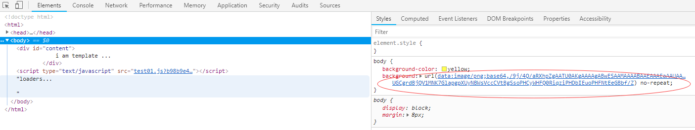
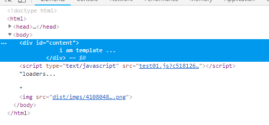

# webpack4.x 背景图片的引入

[参考实例](https://blog.csdn.net/xyphf/article/details/79830002)

1. 处理图片涉及两个loader,分别是:**

* url-loader

* file-loader

**2. 安装url-loader和file-loader**

~~~
npm i url-loader file-loader -D
~~~

**3. 配置rules**

~~~js
module:{
		//配置一个rules(规则),是一个数组,里面可以包含多条规则
		rules:[
			{
				//test表示测试什么文件类型
				//利用正则表示所有以.css后缀的样式文件
				test:/\.css$/,
				//使用'style-loader','css-loader'
				use:['style-loader','css-loader']
			},{
				test:/\.(png|jpg|gif)$/,
				use:['url-loader']
			}
		]
	}
~~~

**4. 运行,观察结果**

~~~
npm run build
npm run dev
~~~

### 插入一张图片

那么插入一张图片也可以使用,我们在index.js里面引入一张图片

~~~js
import imgSrc from './imgs/timg.jpg';
let oImg = new Image();
oImg.onload = function(){
    document.body.appendChild(oImg);
};
oImg.src = imgSrc;
~~~

 

### limit参数以及输出路径

**设置是否转换为base64的图片大小,关于打包后css背景图的路径问题,背景图片输出的文件夹**

~~~js
//配置一个rules(规则),是一个数组,里面可以包含多条规则
rules:[
    {
        //test表示测试什么文件类型
        //利用正则表示所有以.css后缀的样式文件
        test:/\.css$/,
        //使用'style-loader','css-loader'
        use:['style-loader','css-loader']
    },{
        test:/\.(png|jpg|gif)$/,
        use:{
            loader:'url-loader',
            options:{// 这里的options选项参数可以定义多大的图片转换为base64
                limit:150000, // 表示小于150kb的图片转为base64,大于150kb的是路径
                outputPath:'imgs'
            }
        }
    }
]
~~~

# 分离CSS

这时需要使用到**extract-text-webpack-plugin**

1. 针对webpack3.x版本

   ~~~
   npm i extract-text-webpack-plugin -D
   ~~~

2. 针对webpack4.x版本

   ~~~
   npm i extract-text-webpack-plugin@next -D
   ~~~

3. 引入

   ~~~
   const ExtractTextPlugin = require('extract-text-webpack-plugin')
   ~~~

4. 在plugins中调用插件(配置提出来的css名称以及提到哪里)

   ~~~
   new ExtractTextPlugin('css/index.css') //都提到index.css里面
   ~~~

5. .css文件增加一个处理函数**ExtractTextPlugin.extract**提取出**css**出来

    ~~~
      //配置一个rules(规则),是一个数组,里面可以包含多条规则
       rules:[
       {
           //test表示测试什么文件类型
           //利用正则表示所有以.css后缀的样式文件
           test:/\.css$/,
           //使用'style-loader','css-loader'
           //use:['style-loader','css-loader']
               use:ExtractTextPlugin.extract({
               fallback:'style-loader',//回滚
               use:'css-loader',
               publicPath:'../' //解决背景图丢失问题
               })
       },{
           test:/\.(png|jpg|gif)$/,
           use:{
               loader:'url-loader',
               options:{// 这里的options选项参数可以定义多大的图片转换为base64
                 limit:150000, // 表示小于150kb的图片转为base64,大于150kb的是路径
                 outputPath:'imgs'
               }
      		 }
    	   }
       ]
    ~~~

