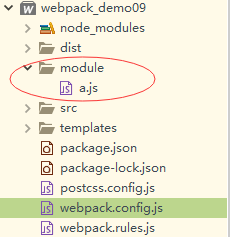

# webpack模块化

**1. 在webpack.config.js文件中的rules模块化,单独抽离出来,新建webpack.rules.js中添加内容如下:**

~~~js
const ExtractTextPlugin = require('extract-text-webpack-plugin')
const rules = {
		//配置一个rules(规则),是一个数组,里面可以包含多条规则
		rules:[
			{
				//test表示测试什么文件类型
				//利用正则表示所有以.css后缀的样式文件
				test:/\.css$/,
				//使用'style-loader','css-loader'
				//use:['style-loader','css-loader']
				use:ExtractTextPlugin.extract({
					fallback:'style-loader',//回滚
					use:['css-loader','postcss-loader'],
					publicPath:'../' //解决背景图丢失问题
				})
			},{
				test:/\.(png|jpg|gif)$/,
				use:{
					loader:'url-loader',
					options:{// 这里的options选项参数可以定义多大的图片转换为base64
						limit:150000, // 表示小于150kb的图片转为base64,大于150kb的是路径
						outputPath:'imgs'
					}
				}
			},
			{
                test:/\.less$/,
                //use:['style-loader','css-loader','less-loader']
                use:ExtractTextPlugin.extract({
                    fallback:'style-loader',
                    use:['css-loader','less-loader']
                })
            }
		]
	}
module.exports = rules
~~~

2. `在webpack.config.js文件中引入:`

   ~~~js
   //引入webpack.rules.js
   const rulesConfig = require('./webpack.rules.js');
   module.exports={
       //其他配置...,
       module:rulesConfig,
       //其他配置...
   }
   ~~~

3. 打包部署...

#### 操作实例

* 目录结构如下:

 

* **a.js文件中编译内容如下:**

  ~~~js
  function show(){
  	return "我是模块"
  }
  
  module.exports = show
  ~~~

* webpack.config.js文件中进行引入

  ~~~js
  const modTest = require('./module/a.js')
  console.log('===='+modTest()+'====')
  ~~~

